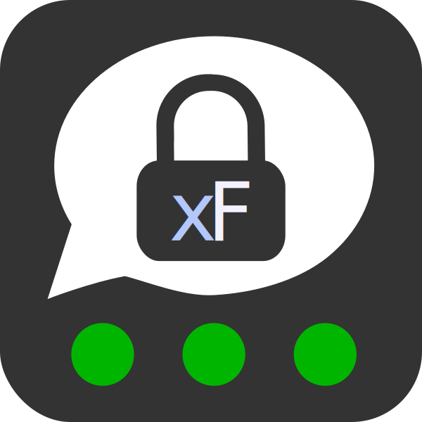

#  XenForo - Threema Gateway (two-factor-authentication)

<!-- video link/preview gif on the right site -->

<!-- badges -->

This add-on integrates the secure instant-messaging app [Threema](https://threema.ch) into the forum software XenForo. Using the [Threema Gateway](https://gateway.threema.ch) it offers three new [two-step authentication](https://xenforo.com/community/threads/two-step-verification-and-security-improvements.99881/) (also called two-factor authentication) modes for users and admins.

## Features

**[Three 2FA modes](docs/2faMethods.md) offer you and your users a flexible and secure way for easily securing their account**. Multiple settings allow server admins to configure and/or restrict any aspect of the add-on and one can always extend this add-on to do other things with the Threema Gateway.

### Users
* Multiple two step/two factor authentication modes allow you to choose the most suitable for yourself.
* For each authentication method there are several options, which can be set by the user.
* Users can use different Threema IDs for each two step verification method.
* All methods work flawless on [mobile](https://cdn.rawgit.com/rugk/xenforo-threema-gateway/9bc57e61/docs/screencasts/allMobile.webm) and on [desktop](https://cdn.rawgit.com/rugk/xenforo-threema-gateway/9bc57e61/docs/screencasts/allDesktop.webm) devices.
* Users can add their Threema ID to their profile.
* Your Threema ID is automatically looked up based on your mail or phone number. (configurable by the server admin)

### Administrators
* You can use both the basic mode and the end-to-end mode. (although the latter is recommend and provides more features)
* You can see the Gateway status in the ACP at a glance.
* You can see your remaining credits in the ACP at a glance.
* You can use the Gateway completely without offering two factor authentication (2FA) or limit the 2FA methods.
* The ACP helps you with the whole setup. Beginning with the installation of Libsodium until creating your private key and configuring the add-on's settings.
* An [installation guide](https://github.com/rugk/xenforo-threema-gateway/wiki/Setup) helps you through all steps you need to make this add-on working.

### Developers
* This add-on can easily be extended as it provides an API you can use to do your own things with the Threema Gateway.
* You can find extensive instructions in the [`docs`](docs/) dir.

### Security
* This add-on is open source, so you and other people can check what it does and that nothing malicious is done.
* You can set permissions which users can send or receive messages with the Threema Gateway.
* Threema ID verification QR codes are shown when appropiate. Their generation is done (locally) on the XenForo server/in the users's browser.
* Sensitive settings are hidden in the ACP and you can even prevent administrators from viewing your remaining credits.
* You can generate the private key on the server and even place it outside of the web root by just specifying the file path. This means your private key never leaves the server! You also do not have to enter it into the web interface and it is never saved in the database.
* You can even hardcode your private key and other details into the PHP file instead of using the XenForo settings or the file storage (for the private key file).
* Permissions allow you to control every aspect of your Gateway.
* This add-on integrates itself into XenForo's health check.
* This add-on does only make external calls to the Threema Gateway server.
* By default the add-on uses the [advanced settings](https://github.com/rugk/threema-msgapi-sdk-php#user-content-creating-a-connection-with-advanced-options) of the PHP SDK, which provide better HTTPS security when sending messages.
* You can further improve the advanced connection settings with a few clicks in the ACP.
* The Gateway server pin is automatically [pinned](https://www.owasp.org/index.php/Certificate_and_Public_Key_Pinning) when possible. (requires cURL >= v7.39)

## Requirements
* PHP 5.4 or later
* XenForo 1.5 or later
* Libsodium (strongly recommend, install guide included)
* curl (>= v7.39 suggested for better security)
* MySQL 5.5.3 or higher
* HTTPS on server (recommend, required for receiving messages and some details)  
   If you have not set it up use [Let's Encrypt](https://letsencrypt.org/), certificates must be valid (self-signed certificates are not accepted).

## Get it now!

* [Build it by yourself](/docs/Build.md) or
* [Download the latest release](releases/latest)

## Support this project

or [donate easily via PayPal.me](https://paypal.me/rugk).
