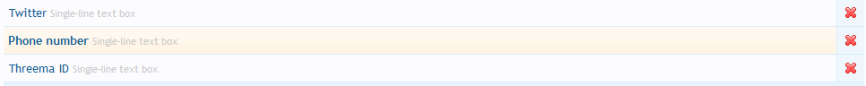
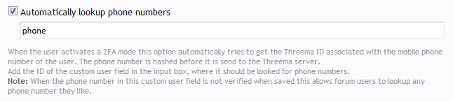

# Frequently asked questions

## General

### I'd like to use the 2FA with Threema for my own forum, but I don't use XenForo. Will there be any ports for other forum software?

Currently there are no plans to do so. However it is certainly possible and any developer can do so as the PHP SDK and this add-on are both open-source.

Basically it would be very good to have already some support for two-factor-authentication implemented in the forum software. (see next two questions)

### Why did you choose XenForo?

The main reason was that XenForo v1.5 added two-factor-authentication as native feature of XenForo and allowed it to be expanded by add-ons. Many users requested SMS 2FA.
However SMS is insecure (see "[Why not just SMS?](#why-not-just-sms)") and the Threema Gateway is just perfectly suitable for such a task as sending one time passwords to users.

### Why is the add-on only compatible with XenForo 1.5?

The reason is that XenForo 1.5 introduced two-factor-authentication and the 2FA modes of this add-on work as a 2FA provider internally. As the add-on depends on this feature, it does not work with earlier versions of XenForo.

### Why did you choose Threema? I'd like to have WhatsApp instead!

This has several reasons:
1. WhatsApp is not privacy aware.
2. WhatsApp does not yet have a easy-to-use, secure API which allow sending or receiving of such messages.

The advantages of Threema (Gateway) are:
1. The messages can be send end-to-end encrypted.
2. It is cheap. (cheaper than SMS)
3. The messages are all send through servers in Switzerland.
4. Threema allows you to accept/decline messages, which is used in the "Fast login" method

More advantages of Threema and the Threema Gateway can be found [in the FAQ](https://threema.ch/en/faq/special_because) and [on the official Gateway website](https://gateway.threema.ch).

### And why no other messenger such as Telegram or Signal?

These two messengers also have no easy and secure API for sending messages to users.

In case you ask for a messenger which actually has this, I'm interesed in hearing about it. However I currently have no plan to implement this for other messengers.
You may do it by yourself and let inspire you by this addon or even reuse some code (it's open-source).

### Can you make something similar for other forum software?

Sure, but as [explained above](#why-did-you-choose-xenforo) for XenForo it was more easy to implement than (potentially) other boards as they already have a 2FA system build-in.

If your aim is however not to use Threema for 2FA, but as something else, it may of course be possible to implement it in an easier way.
In any case however it all depends on the exact case and on the time I have left for doing it.

As always with [FLOSS](https://en.wikipedia.org/wiki/Free_and_open-source_software#FLOSS) software you can just do it by yourself and reuse some code from this project.

### Why not just SMS?

SMS is [insecure](https://stackoverflow.com/questions/1374979/mobile-programming-how-secure-is-sms), [especially for 2FA](https://www.fredericjacobs.com/blog/2016/01/14/sms-login/). Even the NIST [advocates not to use SMS for 2FA](https://www.iansresearch.com/insights/blog/blog-insights/2016/07/28/sending-out-sms-nist-recommends-shifting-to-alternative-2fa-methods). The Threema Gateway is just perfectly suitable for such tasks as sending OTP (one time passwords) to users.
Additionally sending messages with the Threema Gateway is cheaper than sending SMS messages and it works internationally without any problems.

### But the code generation method via app is more secure, isn't it?

Yes, it is as it works completely offline. That's also the reason why it is shown above the Threema 2FA methods when the user goes to the 2FA settings.

However 2FA verification with Threema is nearly as secure as the [TOTP](https://en.wikipedia.org/wiki/Time-based_One-time_Password_Algorithm) verification (that's how the app verification is called), but it may be much more convenient and the user can choose from several 2FA methods.
Additionally it is always good to have a second 2FA method activated as a backup.

### Is this compatible to XenForo v2?

We will see. Currently I could not test it.

## Using Two-factor-authentication

### Which 2FA mode should I choose?

There are three possible 2FA modes. Whether they are available depends on your server admin.

Generally all modes which are listed first in the 2FA mode overview are more secure and these which are listed last are less secure. In general the ones listed below however provide more convenience.

You can jsut try them out or read [the detailed and somewhat technical description of the different modes](../doc/2faMethods.md) to get more details of how they work and what advantages and disadvantages they have.

### What happens if I lose my Threema ID as a 2FA user?

If you lose access to your Threema ID you cannot use the 2FA method anymore, which used this ID. You may use a backup code of XenForo or another 2FA method if set one up.

Remember you can choose a different Threema IDs for each 2FA mode. Thus you can use one Threema ID even when you loose access to another one.

Always remember to [create a backup](https://threema.ch/en/faq/id_backup_expl) of your Threema ID to prevent such issues. If you have a backup you can just restore it and receive and send messages again.

### Can I see whether end-to-end-encryption is used for my messages?

Yes. At first if the modes "reversed" or "fast login" are available, which require the server admin to receive messages, you can be sure that end-to-end encryption is used as this is a requirement by Threema.

If only the "conventional" mode is available, you can see it in the description of all available modes as the last sentence clearly states when E2E encryption is used:
> The message is sent end-to-end encrypted.

If this sentence is not shown there, no end-to-end encryption is used.

Note that bad server admins could of course manipulate this system, but if your server admin does this, you might think about your membership in the forum again.

## Setup and Troubleshooting

### I have installed the add-on. What to do now? How can I set it up?

See [Setup](../doc/setup.md).

### How can I setup a PHP keystore?

At first note that this is not needed as the database is used by default to store the public keys of Threema IDs.
However when you think you want to use a PHP keystore follow this steps:

1. Create a php file in `library/ThreemaGateway`, e.g. `library/ThreemaGateway/mykeystore.php`.
2. Make sure it is writable. If not e.g. use `chmod` to make it writable. You will get an error later if it is not writable.  
    Also make sure to make it "read-only" for other users on the system, so only the process running PHP with XenForo can read (& write) to it.
3. Go to the Threema Gateway settings in the ACP and select "Use PHP Keystore (not recommend)".
4. Enter the filename (and extension) of your PHP keystore, e.g. `mykeystore.php`.
5. Save the changes.

### How can I hardcode my credentials into the PHP file?

When you do so, please be aware that every update of this addon overwrites these changes and therefore you have to do them again when updating this add-on.

1. Open the file `library/ThreemaGateway/Handler/Settings.php`. There you see the following code snippet:

   ```php
   /**
    * @var string $GatewayId Your own Threema Gateway ID
    */
   private $GatewayId = '';

   /**
    * @var string $GatewaySecret Your own Threema Gateway Secret
    */
   private $GatewaySecret = '';

   /**
    * @var string $PrivateKey Your own private key
    */
   private $PrivateKey = '';
   ```

2. Replace the values in such a way that they e.g. look like this:

   ```php
   /**
    * @var string $GatewayId Your own Threema Gateway ID
    */
   private $GatewayId = '*MYAPIID';

   /**
    * @var string $GatewaySecret Your own Threema Gateway Secret
    */
   private $GatewaySecret = 'ab2defghijKlmnOp';

   /**
    * @var string $PrivateKey Your own private key
    */
   private $PrivateKey = 'private:94af3260fa2a19adc8e82e82be598be15bc6ad6f47c8ee303cb185ef860e16d2';
   ```

3. Now you can remove all data in the ACP options (just set them to a blank field) and if everything is correct you will still see your remaining credits. If not, there will be an error.

Note that the health check displays an error for the edited file afterwards. If you do not want this you can calculate the checksum of the changed file and replace it in `library\ThreemaGateway\Listener\FileHealthCheck.php`.

### What is debug logging?

The debug log saves information about the message processing of the Gateway Callback in a text file on your server.
This means when you have errors with receiving messages you can use the debug mode log to investigate this.

When enabled also some (less detailed) status messages are shown when the Threema Gateway Callback is accessed. This makes it possible to "emulate" message sending and get some useful results. This is mostly only useful for development.

The log does not help you in any way with debugging sending messages or so. (except that you may potentially see when you get incoming receive acknowledgements)

### How can I enable debug logging?

As the logging mode of this add-on saves secret information (plain-text message content and meta-data such as sender) into a log file, it is recommend to only enable this temporary for debugging reasons.
To make it harder to accidentially enable it or leave it enabled, it is required that the XenForo debug mode is enabled. Aditionally when disabling the option the log file should automatically be deleted.

To enable logging, first activate XenForo's debug mode.
Afterwards go intop the ACP options and at the bottom you will find some new settings including one to log all messages into a text file.

**Important:** Please make sure that the text file cannot be accessed by anyone else than yourself! Especially secure it for 

### I get the server error "unsupported message type [TODO: check correct exection]". What does it mean?

This means that someone tried to send you a message, which is not yet supported by the Threema Gateway. This could e.g. include video messages, which are a different type of messages than e.g. file messages and are not yet supported by the Threema Gateway.
What message types are supported depends on the Threema MSGAPI PHP-SDK.

You can savely ignore this error messages. If you want to get more information about it (e.g. who is sending the message) you can use the [debug logging](#how-can-i-enable-debug-logging).

### I get the server error "Message […] has already been received and is already saved. This may indicate a replay attack." or "Message could not be saved: [Zend_Db_Statement_Mysqli_Exception] Mysqli statement execute error : Duplicate entry '[…]' for key 'PRIMARY'". What does it mean?

This indicates that something or someone tried to send you a message to your Threema Callback, which you have already received. The message ID is included in the error in the part which I replaced with `[…]` here.

To debug the reason for this you may [enable debug logging](#how-can-i-enable-debug-logging).
As this Exception is thrown as a part of the mechanism to prevent replay attacks, it could of course happened that someone tried to carry out such an attack. In this case I'd suggest you to investigate the case and change your callback secret (in the ACP).

If you get the MySQLi exception, you will always get two logged exceptions for each issue as the original exception is also logged, so you can get more details about the issue.

### Can I get this add-on to use the Threema IDs from user fields?

Yes, you can! Your custom user field just have to has the ID `threemaid` and this add-on will automatically use it. In the 2FA methods it is however only entered as the default value and users can override it if they want.
The best thing is: This user field will be added automatically when installing this add-on so you do not even have to set it up manually.

Also mail addresses will be automatically looked up if the corresponding option is activated in the settings.

### How can I setup the option to lookup the phone number automatically?

1. Create a custom user field where your users can put their phone number in. You may configure this to be publicly visible or not.
  

2. The new user field gets added:
  

3. Go to the 2FA settings, activate the phone lookup and enter the field ID you choose earlier there:
  

Note that your users have to include the [country calling codes](https://en.wikipedia.org/wiki/List_of_country_calling_codes) in the phone number. So e.g. they have to write "+41 791 234567" instead of "0791 234567". However spaces and the "+" sign at the beginning are not required.  
If it does not work also make sure that the users have the "lookup" permission.

### Messages are not send or received. What should I do?

You should make sure you [setup](../doc/setup.md) everything correctly. Visit the ACP options page and look at the status. There you will maybe see error messages. Also make sure you have enough credits to send messages.

If this does not help, consider opening an issue.

## 2FA Setup & Troubleshooting

### It does not display me the Threema 2FA methods. What's happening?

This add-on has multiple ways which deactivate one or more 2FA methods. Please make sure that...

1. Your server setup is complete (look at the status message in the ACP)
2. Your credentials are correct
3. The user group has enough permissions to use the specific 2FA method. E.g. for the conventional mode the users must have permission to use the Gateway, send messages, fetch public keys (lookup) and use the 2FA mode.
4. The 2FA method is activated in the settings.

Note that the Reversed and Fast mode require the end-to-end mode.

### How can I hide a 2FA method?

There are multiple way to do this. You can hide it...

- for all users by disabling it in the settings
- for some user groups by removing the permission to use the Gateway. Note that this affects all 2FA modes.

### I deactivated a 2FA mode, but users still use this mode to login. How is that possible?

When you disable a 2FA mode this only prevents users from activating this mode. Users, who had this mode activated before, do not notice any difference and can still login with this mode. This makes sure that no users get locked out.
When they disable the mode however, they should not be able to enable it again.

If you want to prevent users from using the 2FA at all, you can limit the permissions for the user/user group, so that they cannot use the Threema Gateway or the 2FA of the Threema Gateway anymore. However be **careful when doing so** as this may cause serious problems, because when users do not use any other 2FA method, they will not only get errors, but will also have no way to login anymore. So be careful when disabling 2FA modes!

### How do I edit the messages send in the 2FA modes?

These messages are saved as phrases. Just search for "Threema" and/or "message" and you should find them. E.g. `tfa_threemagw_conventional_message` contains the long message send in the conventional 2FA mode.

### How do I add smilies to my messages?

All messages this add-on sends are saved as phrases. Unicode emotions cannot be saved in phrases directly.
However you can use Unicode characters in the format `\u<hexnum>`. You can use the same format as in C, C++ or Java source code (where UTF-16 is used). There are also [converters](https://www.branah.com/unicode-converter) for this task.
